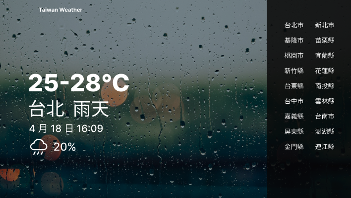
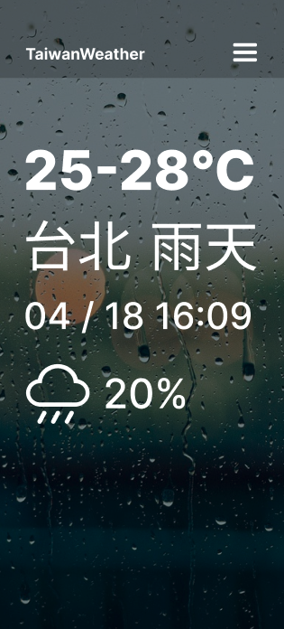
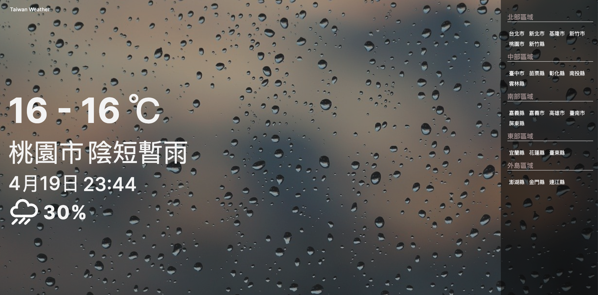
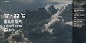
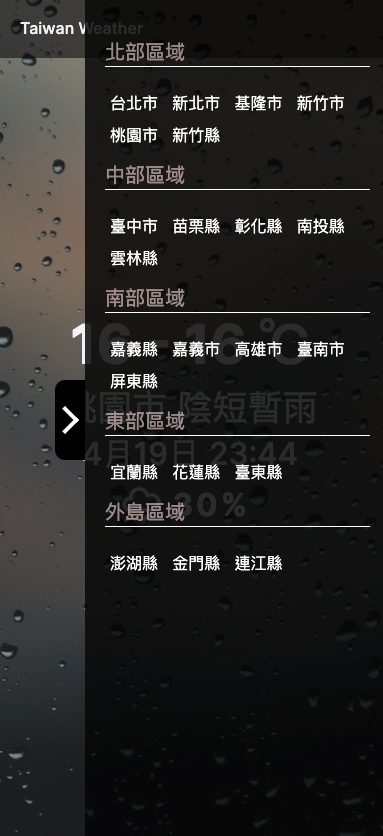
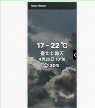

# WeHelp Bootcamp 第 3 組合作開發

## 專案目標：建立天氣 web application

透過串接氣象局開放資料，將地點、氣溫、天氣狀態、日期時間以及降雨機率顯示在畫面上，另外增設側邊欄讓使用者可以點選其他地區；當畫面縮小至手機螢幕時，側欄以箭頭標籤顯示。

### 專案分工：

- html:
  - 左(天氣資訊顯示)：多多
  - 右(側邊欄)：惠娟
- css
  - 左(天氣資訊顯示)：怡君
  - 右(側邊欄)：惠娟
- JS
  - 士堯(串接 API) (組長)
- figma
  - Andrea
- 背景圖 / 會議紀錄 / 簡報
  - Andrea

### 使用技術：

---

    

### 資源

---

- [氣象資料開放平臺](https://opendata.cwb.gov.tw/index)
- [API](https://opendata.cwb.gov.tw/dist/opendata-swagger.html)

### 示意圖 (figma)

---

Desktio :

Mobile:

### 成果圖

---

Desktop:

Demo:

Mobile:

Demo:

### Live Demo

---

[天氣預報網站](https://sholn.github.io/wehelp_group3/html/index.html)
